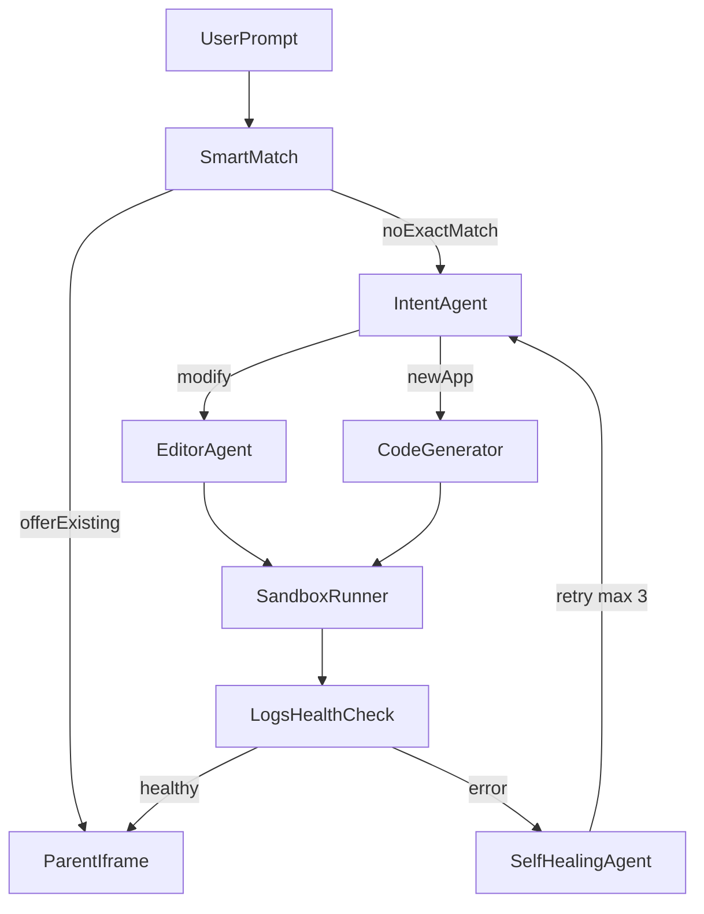

# Terrarium — Architecture and Story Plan

This file is the source of truth for architecture. Story details live in [`docs/stories.catalog.json`](docs/stories.catalog.json). Generated story files in [`docs/stories/`](docs/stories/) are produced by `node scripts/generate-stories.mjs`. Edit the catalog, then re-run the generator. Do not hand-edit generated markdown.

Terrarium is an AI app builder: a user prompt becomes a sandboxed live tool in a parent UI iframe. Agents classify, generate or edit, run in Docker, heal on failure, then stream a preview URL.

## Locked stack

Mixed-language monorepo. The parent UI is TypeScript; orchestration, agents, and the sandbox runner are Python.

**JavaScript (pnpm):**

- `apps/web` — Parent UI (Vite + React + TypeScript + Tailwind)
- `packages/contracts` — Zod schemas and TS types for the parent (HTTP DTOs, events)

**Python (uv workspace):**

- `apps/api` — Orchestration API (FastAPI + Uvicorn)
- `packages/py-contracts` — Pydantic v2 models with the same names and JSON fields as Zod
- `packages/agents` — Intent, Code Generator, Editor, Self-Healing, Smart Match
- `packages/sandbox` — Docker runner, health, sleep/wake, preview URLs

**Shared:**

- `packages/templates` — `react` and `fullstack` starter kits (files only, filled in P2-S2)
- `infra/` — Compose: Postgres, Redis, Traefik, sandbox network

**Live tool:** the parent canvas is always an **iframe** of the sandbox preview URL. Never inline generated HTML. Never use Monaco (or CodeMirror/Sandpack) as the running app. A later optional **Code** tab may mount Monaco to *view* source; that tab is not a current story and is not the preview.

Why: FastAPI is the agent/orchestration runtime; React stays the builder chrome; Docker matches the product diagram; Postgres for tools/users; Redis + ARQ for long agent jobs (Python equivalent of a Redis job queue); Traefik for `{sessionId}.sandbox.local` iframe URLs. JSON field names stay camelCase so web and API share one wire format.

## Pipeline



HTTP path: `POST /sessions` → Redis/ARQ job → SSE `/sessions/{id}/events` → parent iframe `previewUrl`.

Phase 5 Smart Match runs **before** Code Generator. Phase 6 auth is the only identity source; until then use the `dev-user` stub from contracts.

## Hard rules (every story)

- New or changed API, event, or agent I/O is specified in this file, then implemented in **both** `packages/contracts` (Zod) and `packages/py-contracts` (Pydantic) before app code. No third copy in `apps/*`.
- Agents never talk to Docker. They return a `FileMap`. Only `packages/sandbox` starts or stops containers.
- Generated apps run only in Docker with CPU, memory, PID, and network limits. Never on the API host.
- Self-heal is max **3** retries, then emit `heal.exhausted` and show the error in chat.
- Preview is always an iframe URL from the sandbox proxy. Never inline generated HTML in the parent. Monaco is not the live canvas.
- Smart Match never auto-overwrites the user. Offer “Use existing” vs “Build new”.
- Change only the packages listed on the story. Mark the story done in this file when acceptance criteria pass.

## Frozen contracts

Implement these shapes in `packages/contracts` (Zod) and `packages/py-contracts` (Pydantic). JSON keys are camelCase in both. Stories must not invent parallel types.

```ts
export type Stack = "react" | "fullstack";
export type IntentKind = "new" | "modify";
export type ToolRole = "owner" | "editor" | "viewer";
export type RuntimeStatus = "booting" | "running" | "unhealthy" | "sleeping" | "stopped";

export type SessionEventName =
  | "session.created"
  | "smartmatch.hit"
  | "smartmatch.miss"
  | "intent.classified"
  | "codegen.started"
  | "codegen.completed"
  | "editor.started"
  | "editor.completed"
  | "sandbox.booting"
  | "sandbox.ready"
  | "sandbox.unhealthy"
  | "heal.attempt"
  | "heal.exhausted"
  | "preview.ready";

export type FileMap = Record<string, string>; // path → contents

export type Intent = {
  kind: IntentKind;
  stack: Stack;
  summary: string;
  toolId?: string;
};

export type AgentJob = {
  sessionId: string;
  intent: Intent;
  prompt: string;
  files?: FileMap;
  errorContext?: { logs: string; health: RuntimeStatus };
};

export type AgentResult = {
  files: FileMap;
  commitMessage: string;
};

export type SessionEvent = {
  name: SessionEventName;
  sessionId: string;
  at: string; // ISO timestamp
  payload?: Record<string, unknown>;
};

export type SandboxHandle = {
  sessionId: string;
  previewUrl: string;
  containerId: string;
};

export type HealthReport = {
  status: RuntimeStatus;
  logs: string;
};
```

Until Phase 6: `actorId` is always `"dev-user"`.

## Package boundaries

| Package | May import | Must not |
| --- | --- | --- |
| `packages/contracts` | nothing in this repo | Docker, LLM SDKs, React, FastAPI |
| `packages/py-contracts` | nothing in this repo | Docker, LLM SDKs, FastAPI routes, React |
| `packages/agents` | py-contracts, templates | Docker, `apps/*` |
| `packages/sandbox` | py-contracts | LLM SDKs, `apps/web` |
| `apps/api` | py-contracts, agents, sandbox | React UI |
| `apps/web` | `@terrarium/contracts` | Docker, agents, sandbox internals |

## Parallelism

- After **P1-S1**: P1-S2 (web) and P1-S3 (sandbox) in parallel. P1-S4 needs both.
- After **P1-S4**: P2-S1, P2-S2, P2-S3 in parallel. **P2-S4** needs those three plus sandbox health.
- **P3-S1** can start against session stubs before P2 is done.
- **P4-S1** can start in parallel with P2 (schema only). Publish and sleep need sandbox.
- **P5** needs Publish (P4-S2).
- **P6** schema/UI after P4-S1. Enforcement (P6-S4) last.

## Definition of done (every story)

- Acceptance criteria in the story file are met.
- If the story lists contract changes, Zod in `packages/contracts` and Pydantic in `packages/py-contracts` were updated first.
- No types duplicated outside those two packages.
- Story checkbox below is marked.

## Phase checklist

### Phase 1 — Foundation and Sandbox

- [x] [P1-S1](docs/stories/P1-S1-monorepo-and-contracts.md) Monorepo + Compose + contracts skeleton
- [x] [P1-S2](docs/stories/P1-S2-parent-prompt-shell.md) Parent prompt shell
- [x] [P1-S3](docs/stories/P1-S3-sandbox-runner.md) Sandbox runner
- [ ] [P1-S4](docs/stories/P1-S4-session-api.md) Session API + SSE + stub worker

### Phase 2 — Core Agents

- [ ] [P2-S1](docs/stories/P2-S1-intent-agent.md) Intent Agent
- [ ] [P2-S2](docs/stories/P2-S2-code-generator.md) Code Generator Agent
- [ ] [P2-S3](docs/stories/P2-S3-editor-agent.md) Editor Agent
- [ ] [P2-S4](docs/stories/P2-S4-self-healing-agent.md) Self-Healing Agent (max 3)

### Phase 3 — Real-time UX

- [ ] [P3-S1](docs/stories/P3-S1-split-screen.md) Split-screen chat + iframe
- [ ] [P3-S2](docs/stories/P3-S2-sse-event-stream.md) SSE event stream in chat
- [ ] [P3-S3](docs/stories/P3-S3-live-iframe-refresh.md) Live iframe refresh
- [ ] [P3-S4](docs/stories/P3-S4-healing-ux.md) Healing UX

### Phase 4 — Save, sleep, dashboard

- [ ] [P4-S1](docs/stories/P4-S1-tool-schema.md) Tool / version / session schema
- [ ] [P4-S2](docs/stories/P4-S2-publish-workspace.md) Publish to workspace
- [ ] [P4-S3](docs/stories/P4-S3-idle-sleep-wake.md) Idle sleep / wake
- [ ] [P4-S4](docs/stories/P4-S4-workspace-dashboard.md) Workspace dashboard

### Phase 5 — Smart Match

- [ ] [P5-S1](docs/stories/P5-S1-library-index.md) Library index
- [ ] [P5-S2](docs/stories/P5-S2-smart-match-precheck.md) Pre-check before generate
- [ ] [P5-S3](docs/stories/P5-S3-match-offer-ui.md) Use existing vs build new
- [ ] [P5-S4](docs/stories/P5-S4-match-into-editor-path.md) Accepted match skips Code Generator

### Phase 6 — Access and auth

- [ ] [P6-S1](docs/stories/P6-S1-accounts-login.md) Accounts and login
- [ ] [P6-S2](docs/stories/P6-S2-ownership-roles.md) Ownership and roles
- [ ] [P6-S3](docs/stories/P6-S3-share-teammates.md) Share with teammates
- [ ] [P6-S4](docs/stories/P6-S4-enforce-access.md) Enforce API and preview access

## How developers work a story

1. Open this file and the story under `docs/stories/` (or `@` the story ID in Cursor).
2. Change only listed packages.
3. Update both contract packages if Contract changes is not “none”.
4. Check the box above when acceptance criteria pass.

## Generate story files

```powershell
cd C:\Users\thakur\Desktop\Terrarium
node scripts\generate-stories.mjs
```

## Push stories to Microsoft Loop (Planner)

Loop boards with a Bucket dropdown are Planner plans. There is no Loop import button. Do **not** use `Install-Module Microsoft.Graph` (PowerShellGet is broken on some Windows 5.1 installs).

Requires Node 20+ and a **work/school** Microsoft 365 account that can already open the board.

```powershell
cd C:\Users\thakur\Desktop\Terrarium
node scripts\m365-login.mjs
node scripts\push-stories-to-loop.mjs --planName "Project Terrarium Playground" --bucketName "To do"
```

Re-run without `--update` skips cards whose title already starts with `[P1-S1]` … `[P6-S4]`. To patch those existing cards in place (no delete):

```powershell
node scripts\push-stories-to-loop.mjs --planName "Project Terrarium Playground" --bucketName "To do" --update
```

A device-code / browser prompt will appear on login. Use the **work/school** account that can already open the board. Do not use `npx @pnp/cli-microsoft365` (that package’s binary is `m365`, so npx cannot start it). Do not use `Install-Module`.

If login asks for **App ID** / **tenant**: cancel it (Ctrl+C). Those are Microsoft Entra values, not Loop fields. Run `node scripts\m365-login.mjs` again — it starts `m365 setup`, which **creates** the Entra app. Choose **create a new app** and **full permissions**. To look up an existing app instead: Azure Portal → Microsoft Entra ID → App registrations → Overview → Application (client) ID and Directory (tenant) ID. For tenant you can also use `common`.

Cards are created **unassigned** in To do. Assign people on the board. Re-run without `--update` skips existing `[P1-S1]` titles. `--update` overwrites title and description on those cards and creates any that are missing. If the plan is not found, also pass `--ownerGroupName "Your M365 Group"`.
