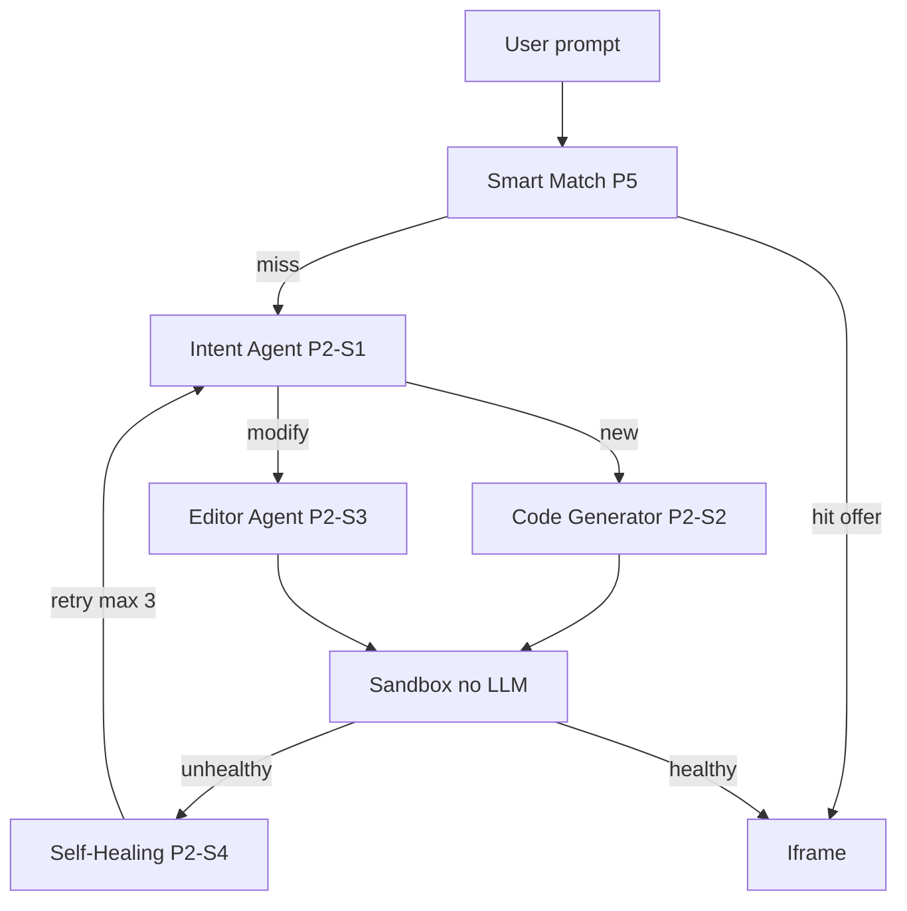

# Terrarium — where LLMs run, and which models to use

Phase 1 has **no LLM**. The stub worker always boots the fixture app. LLMs start in **Phase 2** (`packages/agents`) and **Phase 5** (Smart Match). The API only enqueues jobs and streams events. The sandbox never calls an LLM. Agents return a `FileMap` only; they never start Docker.

Wire models through env vars (for example `TERRARIUM_MODEL_INTENT`) so we can swap providers without changing architecture.

Defaults below are as of **August 2026**. Re-check pricing and SWE-bench before locking a vendor contract. Prefer **structured JSON** (schema) for Intent and Smart Match; prefer **file-map JSON** for Code Generator and Editor.

## Where each LLM sits

| Agent | Story | Calls an LLM? | Job |
| --- | --- | --- | --- |
| Smart Match | P5-S1, P5-S2 | Embeddings, optional tiny rerank LLM | “Do we already have this tool?” |
| Intent | P2-S1 | Yes — small/fast | new vs modify, react vs fullstack, one-line summary |
| Code Generator | P2-S2 | Yes — strong coding | Fill a template into a full `FileMap` |
| Editor | P2-S3 | Yes — strong coding, smaller context if possible | Change only the files the follow-up needs |
| Self-Healing | P2-S4 | Yes — reasoning + code | Read logs, decide Editor vs regenerate, cap 3 |
| Sandbox / Traefik / parent UI | P1, P3 | **No** | Run and display. Never generate HTML in the parent |

## Recommended models by use case

Pick **one cloud family** if the company already has a contract (Anthropic, OpenAI, or Google). Mixing is allowed; Intent and Match should stay cheap.

| Use case | Default | Fallback | Why this class |
| --- | --- | --- | --- |
| **Intent (P2-S1)** | Claude Haiku 4.5, or Gemini 3.1 Flash-Lite / GPT-5.4 Mini | Same-tier from the other vendor | Classification only. Needs JSON `{ kind, stack, summary, toolId? }`, low latency, high volume. A frontier model here wastes money and adds delay before codegen. |
| **Code Generator (P2-S2)** | Claude Sonnet 5 (or Sonnet 4.6 if that is what the account has) | Gemini 3.1 Pro for UI-heavy React; GPT-5.6 Sol / GPT-5.5 for agentic file dumps | Must emit a coherent multi-file app from `templates/react` or `templates/fullstack`. Quality beats price: a bad `FileMap` causes heal loops. |
| **Editor (P2-S3)** | Claude Sonnet 5 | GPT-5.6 Terra / GPT-5.5 if cost matters | Same coding skill as generate, but the prompt is “minimal diff.” Sonnet-class is strong at not rewriting the whole tree. Do not use Haiku/Flash as the only editor — missed files break the preview. |
| **Self-Healing (P2-S4)** | Same as Editor by default; escalate to Claude Opus 4.7 / GPT-5.6 Sol Ultra on attempt 3 | Editor model | Needs to read Docker logs and propose a tight fix. Attempt 1–2: Sonnet. Last attempt: larger reasoning model, still max 3 total. |
| **Smart Match index (P5-S1)** | OpenAI `text-embedding-3-small`, or Voyage-3 if retrieval quality is weak | Local BGE-M3 if data cannot leave the tenancy | This is **not** a chat model. Embed prompt + tool summary. Store a vector or a fingerprint in Postgres. |
| **Smart Match rerank (optional P5-S2)** | Claude Haiku 4.5 or Gemini Flash-Lite | Skip rerank if top-1 embedding score is clearly a hit | Short “is this the same problem?” yes/no. Never auto-accept; UI still asks Use existing vs Build new. |
| **Chat copy / heal UX (P3-S4)** | Same as Intent (Haiku / Flash-Lite) | Template strings, no LLM | Optional. Do not use Opus to write “Retry 2/3”. |

### What not to use

- No LLM in `packages/sandbox` or `apps/web`.
- No image/video models for these agents (text in, JSON/`FileMap` out).
- No local 8B model as the **only** Code Generator in production — fine as a **dev mock** when `TERRARIUM_AGENTS=stub`.
- Do not send secrets, `.env`, or production customer data in agent prompts.

## How this maps to a non-technical explanation

- **Intent** is a receptionist: cheap, fast, only decides “new or change?” and “simple app or fuller app?”
- **Code Generator** is the architect who draws the first whole building from a house plan (the template).
- **Editor** is the contractor who changes one room instead of rebuilding the house.
- **Healer** is QA reading the error log and sending the contractor back, at most three times.
- **Smart Match** is the librarian: embeddings find a similar book; a small model may double-check; a human still chooses.

## Implementation notes for Phase 2

1. Keep a `stub` mode (current P1-S4 echo) behind env so CI does not need vendor keys.
2. Validate every LLM response with Pydantic/`packages/py-contracts` before emitting SSE events. On schema failure, retry once, then `sandbox.unhealthy` / fail the job — do not start Docker with invalid files.
3. Code Generator and Editor must output `AgentResult { files, commitMessage }` only.
4. Budget: expect Intent + Match on every prompt; Code Generator once per new app; Editor on follow-ups; Healer only on red previews.
